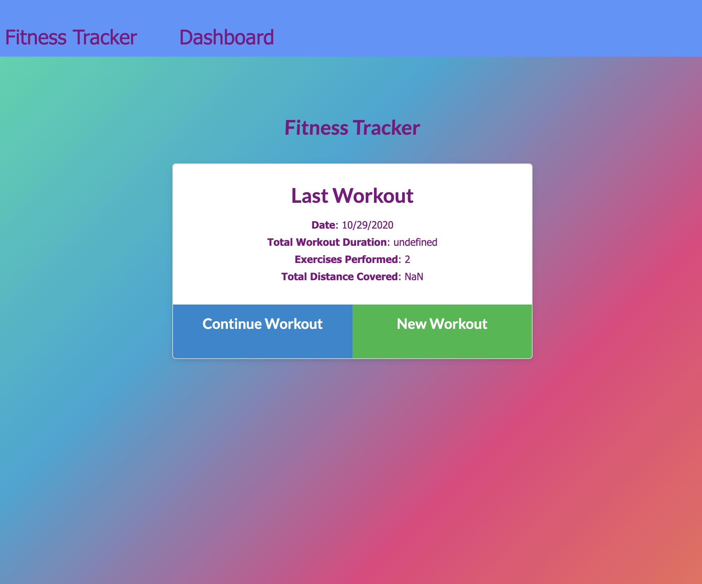
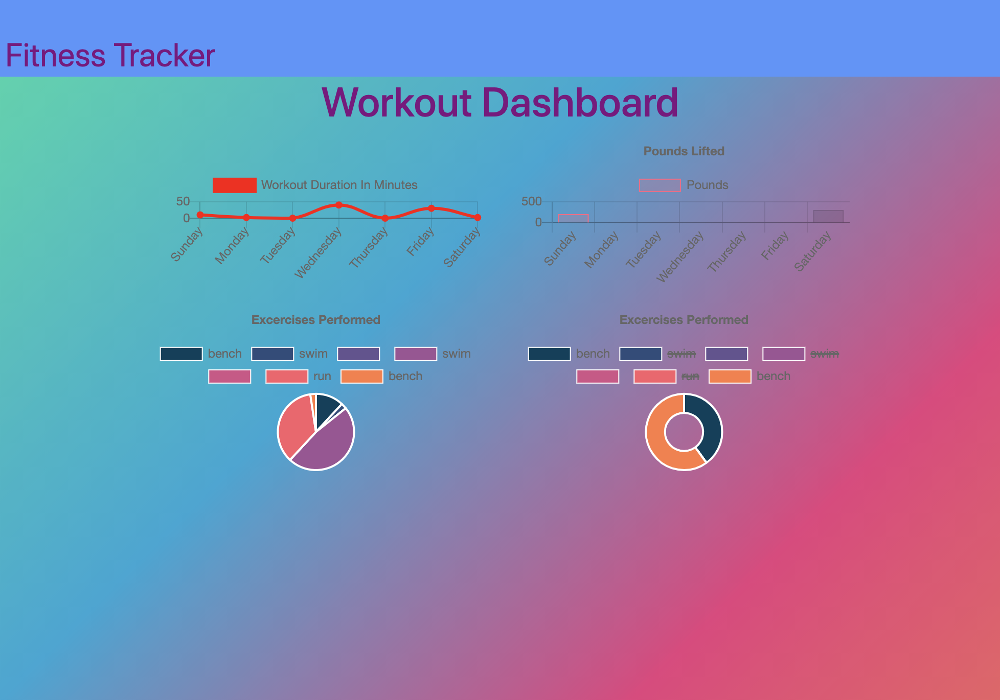

# \\*_Workout Tracker_\*\

## This is a mobile first workout tracking app built with mongoDB. express.js, JavaScript, HTML5 and CSS3. 🏋🏾‍

---

---

# Link To Application 👇🏽

> [Deployed Application](https://blooming-spire-19184.herokuapp.com/?id=5f9b5ca0373da30017012e2f)

# Github Repo 👇🏽

> [Workout Tracker Repo](https://github.com/tajohnsonn/workoutTracker)

# Installation

npm init to get all required modules

>

# License

MIT

>

# Questions ❓

If you have any questions about this project, please open an issue or contact Taylor J. directly at tajohnsonn@gmail.com 👩🏽‍💻

